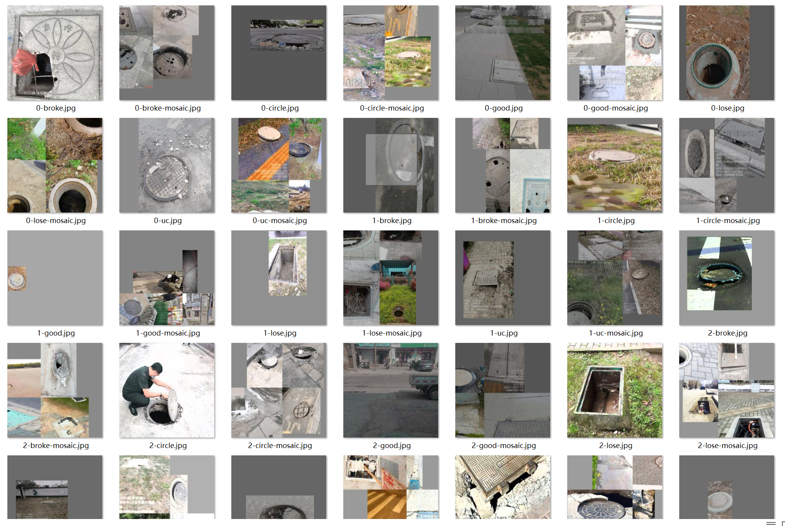
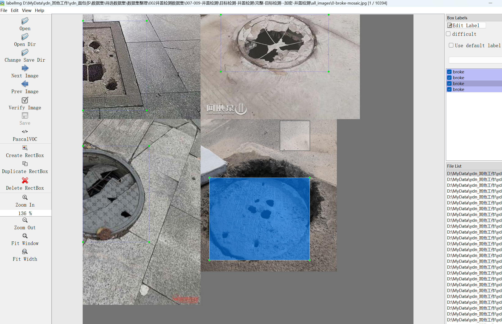
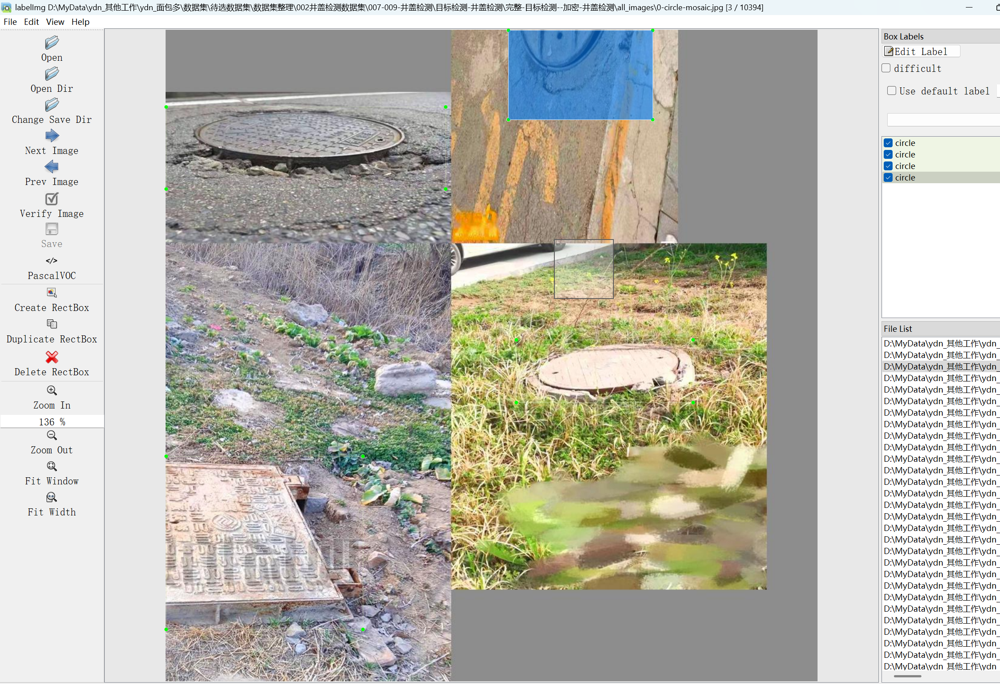
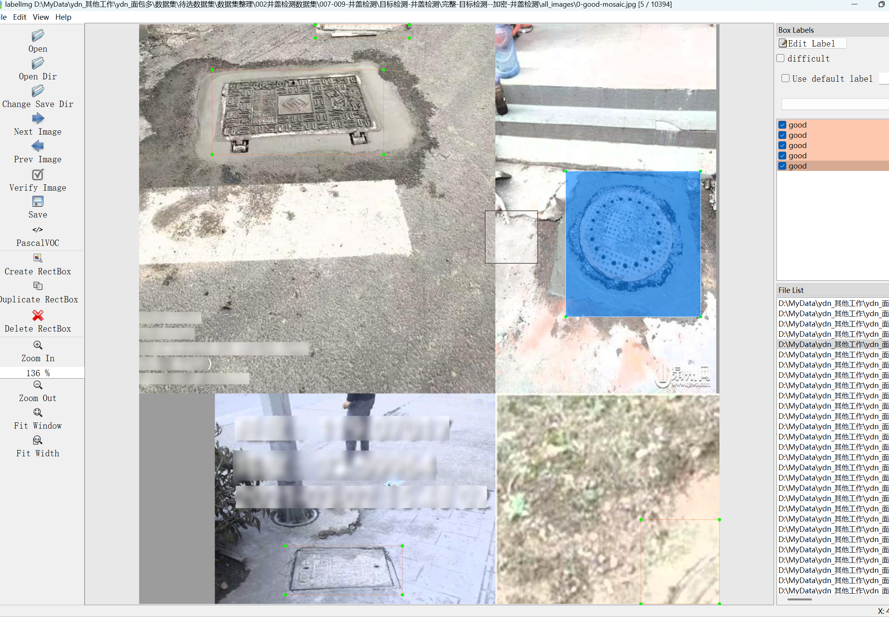

# Detecting Trash Coverage - Target Detection Dataset

Dataset Information: The dataset consists of 10394 images and corresponding annotation files. The annotation files are provided in two formats: XML files in VOC format and txt files in YOLO format. The objects to be detected include the following: ['broken', 'circle', 'good', 'lose', 'uncovered'].

The number of bounding box information for each image is as follows: (Annotations are usually labeled in English, with Chinese provided inside parentheses for reference.)

Note: An image may have multiple objects being labeled, hence the total count of bounding boxes might be greater than the number of images.

The complete dataset includes three folders and one txt file:
- all_images folder: Stores the dataset's images, with screenshots attached below.
- all_txt folder and classes.txt: Stores the YOLO formatted txt annotation files, in the same quantity as the images, each corresponding to an annotation file.

For a detailed understanding of the YOLO format standard file, please search on your own. In short, the first number in the sequence corresponds to the name in the array at position 0 in the classes.txt file.

- all_xml folder: VOC formatted XML annotation files. The quantity matches that of the images; each annotation file is paired with an image.

- How to read the VOC formatted standard file can be found by searching online. Simply put, the first number in the sequence represents the name in the array at position 0 in the classes.txt file.

The two formats of annotations are both usable; choose one according to your preference.

Annotation Screenshots:

## Image

Here is a pay link on Stripe ( https://buy.stripe.com/3cs8yP7sY87d0vu9AB ). Please contact me lonlonago@foxmail.com after funding $89, and I will send you a complete data files , thank you!

